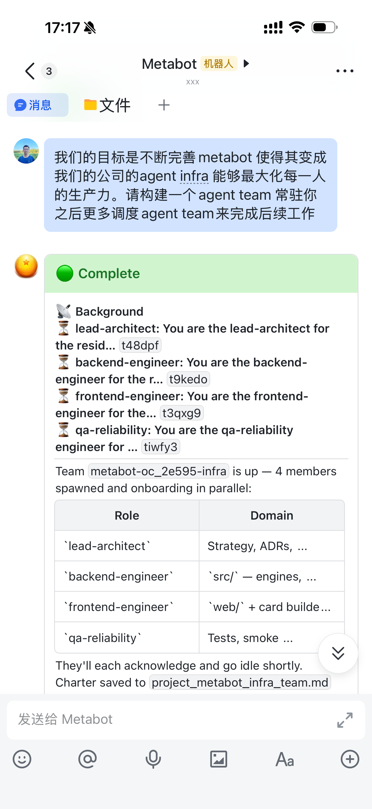
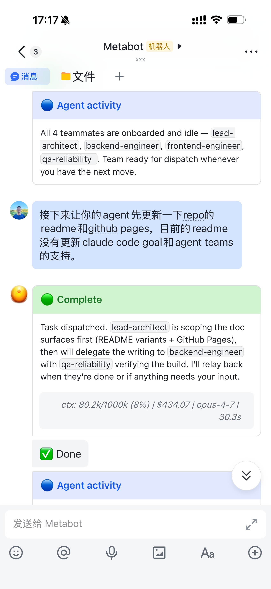
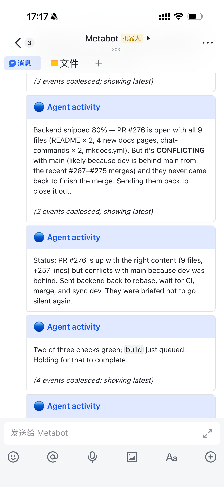
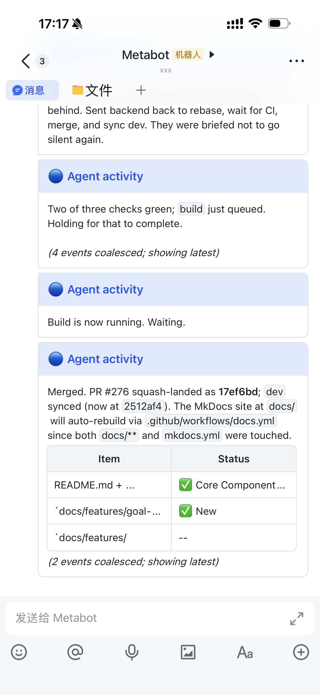

<div align="center">

# 🤖 MetaBot

### 从飞书/Lark、Telegram、Slack、微信或 Web 使用 Codex 和 Kimi Code

_可自托管的个人 Agent 工作台；Claude Code 作为兼容引擎继续保留。_

<p>
  <a href="https://github.com/openai/codex"></a>
  <a href="https://www.kimi.com/code"></a>
  <a href="https://github.com/anthropics/claude-code"></a>
  <a href="https://opensource.org/licenses/MIT"></a>
  
</p>

**中文** · [English](README_EN.md) · [文档站](https://xvirobotics.com/metabot/zh/)

</div>

<div align="center">
<table>
<tr>
  <td width="25%"></td>
  <td width="25%"></td>
  <td width="25%"></td>
  <td width="25%"></td>
</tr>
</table>
<sub>飞书移动端 · 召唤团队 · 分派工作 · 跟进进度 · 合并 PR</sub>
</div>

```bash
curl -fsSL https://github.com/xvirobotics/metabot/releases/latest/download/install.sh | bash
```

带签名校验的安装器约五分钟部署完整个人版：本地 Core、仅 Token 登录的 Web UI、IM Bridge、CLI、Skills 和 PM2 服务。

## 个人版

MetaBot 运行在你自己的机器上，不依赖企业 SSO、OIDC、VPN 或员工目录。

- 本地 Core 和个人控制台默认为 `http://localhost:9200`。
- 只有一个 Web 前端：Core Console。原 Bridge `http://localhost:9100/web/` 入口会重定向到 `http://localhost:9200/chat`，不再单独构建或维护。
- 安装器自动生成 Bearer Token，以 `0600` 权限保存到 `~/.metabot-core/token`，且不会写入日志。
- Core 数据默认在 `~/.metabot-core/`，Bridge 状态默认在 `~/.metabot/`。
- Release 资源解压前会验证校验和。
- 使用 `METABOT_INSTALL_CORE=0` 仍可连接已有外部 Core。

自定义目录、源码安装、更新、Windows 状态和外部 Core 配置详见[安装文档](docs/getting-started/installation.zh.md)。

默认安装目录为 `~/metabot`。可用
`METABOT_HOME=/opt/metabot bash install.sh` 覆盖；源码 checkout 与 Release
安装保留各自的更新路径，`metabot update` 不会盲目猜测。

## 引擎

Codex 是默认引擎，Kimi Code 是一级可选引擎。Claude Code 继续保留，确保现有 Claude Bot 和工作区仍能运行。

| 引擎                 | 接入方式                                   | 认证                                  | 当前开源版能力                                                                     |
| -------------------- | ------------------------------------------ | ------------------------------------- | ---------------------------------------------------------------------------------- |
| **Codex CLI**        | `codex exec --json` 和 `codex exec resume` | `codex login` 或 OpenAI 兼容 API 配置 | JSONL 流式输出、工具、会话续接、`/model`、`/effort`、Bridge 管理的 Goal 和后台任务 |
| **Kimi Code 0.27+**  | Kimi Web 前端同源的官方本地 Server API     | `kimi login`                          | 持久 Session、原子快照、问题交互、停止/续接、工具、子 Agent 和 Goal                |
| **Claude Code 兼容** | Claude CLI / Agent SDK 兼容路径            | `claude login` 或 Anthropic 兼容 API  | 继续支持现有 Claude 会话、Skills 和工作区                                          |

当前公开版 Codex 适配器使用 `codex exec`；Codex app-server 以及 Codex/Kimi 的飞书执行中 steering 将在后续基础链完整后开放。

请在独立终端安装或登录引擎：

```bash
npm install -g @openai/codex
codex login

npm install -g @moonshot-ai/kimi-code@latest   # Kimi Code 0.27+
kimi login
```

每个 Bot 在 `bots.json` 中独立选择引擎；省略时默认为 `codex`。详见[多 Bot 配置](docs/configuration/multi-bot.zh.md)和[环境变量](docs/configuration/environment-variables.zh.md)。

各引擎继续使用自己的工作区约定：

| 内容       | Codex            | Kimi Code         | Claude 兼容          |
| ---------- | ---------------- | ----------------- | -------------------- |
| 工作区说明 | `AGENTS.md`      | `AGENTS.md`       | `CLAUDE.md` 兼容入口 |
| Skills     | `.codex/skills/` | `.agents/skills/` | `.claude/skills/`    |
| 订阅状态   | Codex profile    | `~/.kimi-code/`   | Claude credentials   |

安装器会把 MetaBot 内置 Skills 镜像到当前引擎路径，并保留用户已修改的本地 Skills。

## 快速开始

前置条件：**Node.js >= 22.19**、Git，以及至少一个引擎和一个聊天渠道的凭证。

1. 执行上面的一行安装命令。
2. 选择 Codex 或 Kimi Code，并在独立终端完成登录。
3. 按引导连接飞书/Lark、Telegram 或微信。
4. 验证服务并打开本地控制台：

```bash
metabot status
metabot health
```

打开 `http://localhost:9200`，粘贴 `~/.metabot-core/token` 中的 Token，再选择 Bot。

Core Console Chat 在同一个页面里展示流式回复、工具执行和输出文件，支持回答
Agent 的交互问题、停止运行，以及浏览器或 Bridge STT 语音输入。Agents、Memory、
Skills、T5T、Teams 和 CLI Access 共用同一 Token 与同一套导航。

| 渠道          | 适合场景                                   | 配置入口                                                    |
| ------------- | ------------------------------------------ | ----------------------------------------------------------- |
| **飞书/Lark** | 工作空间、流式卡片、文件、群聊路由         | [飞书应用配置](docs/getting-started/feishu-app-setup.zh.md) |
| **Telegram**  | 最快个人配置；不需要公网 IP                | [快速配置](docs/getting-started/quick-setup.zh.md)          |
| **Slack**     | DM 和 @mention 路由；适合已有 Slack 工作区 | [Slack 指南](docs/features/slack.zh.md)                     |
| **微信**      | 通过 ClawBot 接入个人微信；目前灰测中      | [微信指南](docs/features/wechat.zh.md)                      |
| **Web**       | 浏览器 Chat、Core、Memory、Teams 和设置    | `http://localhost:9200`                                     |

飞书使用长连接 WebSocket，Telegram 和微信使用长轮询；Slack 使用 Events API，需要一个
可被 Slack 访问并经过 HTTPS 反向代理保护的 `/api/slack/events/<botName>` 入口。

飞书群里的普通消息只路由给被准确 @ 的 Bot。群主可以用
`@Bot /group-reply ...` 为每个 Bot、每个群选择仅 @ 或回复全部消息；裸命令
和只 @ 其他 Bot 的命令会被忽略。仅 @ 模式下，未 @ 的文件会保留给下一条
@Bot 指令。详见[聊天命令](docs/usage/chat-commands.zh.md#group-reply-modes)。

## 最小双 Bot 配置

一个 Bridge 进程的 `bots.json` 可以混用引擎和工作区：

```json
{
  "feishuBots": [
    {
      "name": "codex-dev",
      "engine": "codex",
      "feishuAppId": "cli_xxx",
      "feishuAppSecret": "...",
      "defaultWorkingDirectory": "/home/me/project-a"
    },
    {
      "name": "kimi-reviewer",
      "engine": "kimi",
      "feishuAppId": "cli_yyy",
      "feishuAppSecret": "...",
      "defaultWorkingDirectory": "/home/me/project-b",
      "kimi": { "thinking": true }
    }
  ],
  "slackBots": [
    {
      "name": "slack-codex",
      "engine": "codex",
      "slackBotToken": "xoxb-...",
      "slackSigningSecret": "...",
      "defaultWorkingDirectory": "/home/me/project-c"
    }
  ]
}
```

每个 Bot 拥有独立的渠道凭证、引擎、工作区和会话，同时仍可通过 Agent Teams 和 Agent Bus 协作。

## 包含的能力

- **移动端写代码** — 从聊天中改代码、跑测试、查看工具并跟进长任务。
- **Agent Teams** — 创建专门队友、并行分工，保留持久的任务和运行状态。[指南](docs/features/agent-teams.zh.md)
- **MetaMemory** — 跨会话检索知识，并可同步到飞书知识库。[指南](docs/features/metamemory.zh.md)
- **T5T 与 Goal** — 持久项目检查点和受监督的多轮执行。[聊天命令](docs/usage/chat-commands.zh.md)
- **Skill Hub** — 通过统一的 `metabot` CLI 安装和发布可复用 Skills。
- **统一 Core Console** — Token 鉴权的 Chat、Agents、Memory、Skills、T5T、Teams、CLI Access 和诊断；不再维护第二套 Bridge Web UI。
- **渠道与媒体** — 文本、富文本、图片、文件、音频、智能合并和精确 @Bot 路由。
- **Peers、调度与语音** — 面向更大个人环境的可选能力。[功能文档](docs/)

## 常用命令

| 命令                                           | 用途                                             |
| ---------------------------------------------- | ------------------------------------------------ |
| `/model`                                       | 查看或切换当前引擎/模型                          |
| `/effort low\|medium\|high\|xhigh\|max\|ultra` | 设置当前 Chat 的 Codex 推理强度                  |
| `/status`                                      | 查看当前会话和模型                               |
| `/reset`                                       | 开始新会话                                       |
| `/stop`                                        | 停止当前任务                                     |
| `/goal <条件>`                                 | 跨轮持续工作，直到完成、阻塞或到达上限           |
| `/background <提示>`                           | 在 Chat 继续使用时运行受支持的后台任务           |
| `@Bot /group-reply mention\|all\|status`       | 控制一个飞书 Bot 在一个群里的回复模式            |
| `metabot update`                               | 将 Package 管理的个人版升级到最新 GitHub Release |
| `metabot update --package --version 1.3.0`     | 精确安装不可变的 v1.3.0 Release 包               |

完整命令详见[聊天命令](docs/usage/chat-commands.zh.md)、[CLI 参考](docs/reference/cli-metabot.zh.md)和 [REST API](docs/reference/api.zh.md)。

## 文档

- 开始：[安装](docs/getting-started/installation.zh.md) · [快速配置](docs/getting-started/quick-setup.zh.md) · [故障排除](docs/troubleshooting.zh.md)
- 产品：[Core Console](docs/features/web-ui.zh.md) · [多 Bot 与引擎](docs/configuration/multi-bot.zh.md) · [Slack](docs/features/slack.zh.md) · [MetaMemory](docs/features/metamemory.zh.md) · [Agent Teams](docs/features/agent-teams.zh.md)
- 参考：[聊天命令](docs/usage/chat-commands.zh.md) · [CLI](docs/reference/cli-metabot.zh.md) · [REST API](docs/reference/api.zh.md) · [环境变量](docs/configuration/environment-variables.zh.md)
- 运维与开发：[架构](docs/concepts/architecture.zh.md) · [生产部署](docs/deployment/production.zh.md) · [贡献指南](CONTRIBUTING.md)

## 更新与开发

普通 Package 管理的个人版执行 `metabot update` 时，默认升级到最新 GitHub
Release。需要可复现版本时可固定不可变 Release；源码 checkout 保留显式 Git
路径：

```bash
metabot update                                  # 最新 GitHub Release
metabot update --package --version 1.3.0        # 精确安装 v1.3.0
metabot update --git                            # 源码 checkout
```

Package 更新会验证 `SHA256SUMS`，校验完整个人版 Manifest 及其版本，并在固定
版本不匹配时拒绝更新。覆盖安装会保留 `.env`、`bots.json`、`data/`、`logs/`、
`~/.metabot/` 和 `~/.metabot-core/`。
其中只有 Package 管理的 `~/.metabot/default.env` 可能随安全默认值刷新。

参与开发：

```bash
git clone https://github.com/xvirobotics/metabot.git ~/metabot
cd ~/metabot
npm ci --include=dev
npm test
```

请使用 Node.js >= 22.19，并在提交 PR 前阅读[贡献指南](CONTRIBUTING.md)。

## 安全

MetaBot Agent 可以在配置的工作区中读、写和执行代码。请妥善保管 Core 与 Bridge Token，限制 IM Bot 可见范围，仅通过自有鉴权反向代理或私有网络暴露本地端口。

## 关于与许可

MetaBot 由 [XVI Robotics](https://xvirobotics.com) 开发，采用 [MIT License](LICENSE) 开源。
