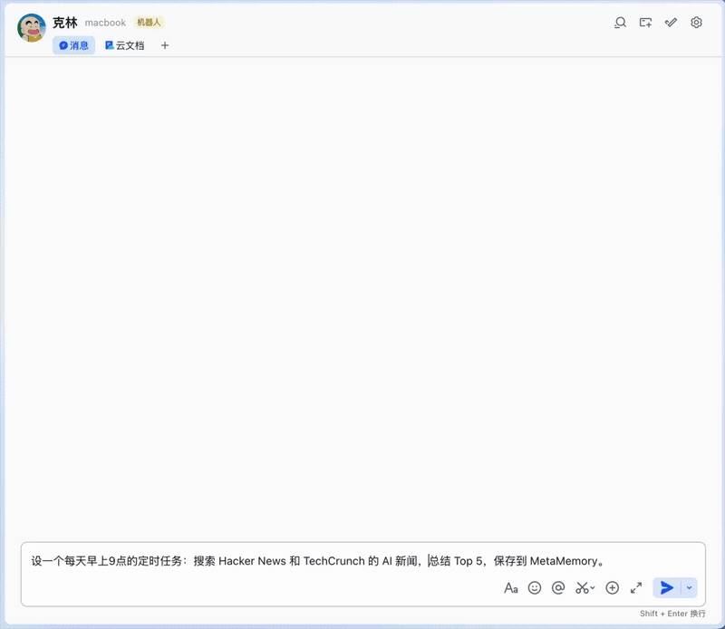
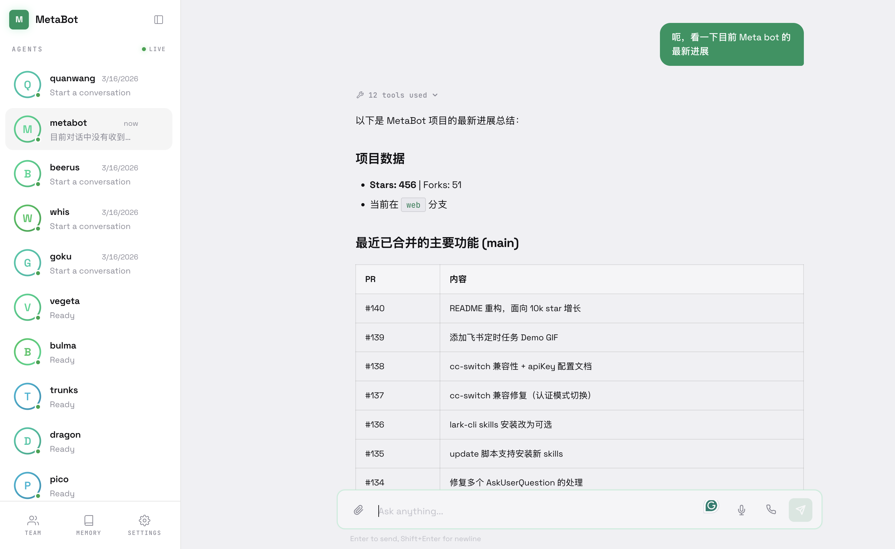

<div align="center">

# 🤖 MetaBot

### Control Claude Code, Kimi Code, or Codex CLI from your phone via Feishu / Telegram / WeChat

*Write code · Manage agents · Automate everything*

<p>
  <a href="https://github.com/xvirobotics/metabot/actions"></a>
  <a href="https://opensource.org/licenses/MIT"></a>
  <a href="https://github.com/xvirobotics/metabot"></a>
  <a href="https://github.com/xvirobotics/metabot/network/members"></a>
</p>

<p>
  <a href="https://github.com/anthropics/claude-code"></a>
  <a href="https://platform.moonshot.ai"></a>
  <a href="https://github.com/openai/codex"></a>
  
  
</p>

<p>
  <a href="https://feishu.cn"></a>
  <a href="https://telegram.org"></a>
  <a href="https://ilinkai.weixin.qq.com"></a>
  
</p>

[中文](README.md) · **English** · [📚 Docs](https://xvirobotics.com/metabot/)

</div>

> **Claude Code**, **Kimi Code**, and **Codex CLI** — three first-class engines. Subscription or API key, your choice. Each bot picks its own engine.



```bash
curl -fsSL https://raw.githubusercontent.com/xvirobotics/metabot/main/install.sh | bash
```

The installer walks you through everything: working directory → **engine choice (Claude / Kimi / Codex)** → subscription login → IM platform → auto-start with PM2. **5 minutes to get started.**

> Custom install directory (default `~/metabot`): `curl ... | bash -s -- --dir /opt/metabot`, or `METABOT_HOME=/opt/metabot bash install.sh`. Windows: `.\install.ps1 -Dir C:\opt\metabot`.

---

## Multi-Engine: Claude Code, Kimi Code, and Codex CLI

MetaBot isn't locked to one vendor — all three top AI coding agents ship with native support, and **your subscription works directly**.

| | **Claude Code** (Anthropic) | **Kimi Code** (Moonshot) | **Codex CLI** (OpenAI) |
|---|---|---|---|
| **Subscription login** | ✅ `claude login` OAuth | ✅ `kimi login` | ✅ `codex login` — uses your ChatGPT subscription |
| **API key fallback** | ✅ `ANTHROPIC_API_KEY` or third-party Anthropic-compat endpoints | ✅ Moonshot API key | ✅ `OPENAI_API_KEY` / Codex profile |
| **Context window** | 200k (1M optional on Opus/Sonnet) | 256k (kimi-for-coding) | 400k (gpt-5.x-codex) |
| **Tools** | Read/Write/Edit/Bash/Glob/Grep/WebSearch/MCP | Same (Kimi CLI builtin + `.claude/skills/` auto-discovery) | Codex CLI native sandbox + shell toolchain |
| **Autonomous mode** | `bypassPermissions` | `yoloMode` (equivalent) | `--dangerously-bypass-approvals-and-sandbox` |
| **Subagents** | `.claude/agents/*.md` auto-loaded | Builtin `default` / `okabe` only | Subagents not supported yet |
| **Workspace doc** | `CLAUDE.md` | `AGENTS.md` (installer creates the symlink) | `AGENTS.md` (Codex convention) |

**One line of config** — each bot picks its engine:
```json
{ "name": "bulma", "engine": "kimi",   "kimi": { "thinking": true } }
{ "name": "goku",  "engine": "claude" }
{ "name": "vegeta", "engine": "codex", "codex": { "model": "gpt-5.4-codex" } }
```

Codex support uses the local `codex exec --json` CLI and resumes chat sessions with `codex exec resume`. Authenticate once with `codex login` (or configure your Codex API key/profile) before starting MetaBot.

Run your frontend bot on Claude and your backend bot on Kimi? Totally fine. The Agent Bus lets them delegate to each other — the calling bot doesn't need to know which engine is on the other side.

---

## What You Can Build

- **Code from your phone** — message Claude Code / Kimi Code / Codex CLI from Feishu on the subway, it fixes bugs, opens PRs, runs tests
- **Multi-agent teams** — frontend bot, backend bot, infra bot, each in their own workspace (even their own engine), delegating via Agent Bus
- **Self-growing knowledge** — agents save what they learn to MetaMemory, the organization gets smarter daily
- **Automated pipelines** — "Search AI news every morning at 9am, summarize top 5, save to archive" — one sentence
- **Voice assistant (Jarvis mode)** — "Hey Siri, Jarvis" from AirPods, hands-free voice control of any agent
- **Self-growing organization** — a manager bot creates new agents on demand, assigns tasks, schedules follow-ups

## Why MetaBot

| | MetaBot | Claude / Kimi / Codex CLI (terminal) | Dify / Coze |
|---|---|---|---|
| **Mobile access** | Feishu/TG/WeChat anywhere | Terminal only | Yes, but can't run code |
| **Engine choice** | Claude ✕ Kimi ✕ Codex, three engines | One at a time | None, API calls only |
| **Subscription login** | All three native subscriptions work directly | One at a time | Subscriptions not supported |
| **Code capabilities** | Full Agent SDK (Read/Write/Edit/Bash/MCP) | Full | None |
| **Multi-agent** | Agent Bus + task delegation + runtime creation | Single session | Yes, but closed ecosystem |
| **Shared memory** | MetaMemory with FTS + auto-sync to Wiki | None | None |
| **Scheduling** | Cron jobs, persisted across restarts | None | Yes |
| **Autonomous** | bypassPermissions / yoloMode, fully automated | Requires human approval | Limited to workflows |
| **Open source** | MIT, fully controllable | CLI is open source | Closed-source SaaS |

## Multi-Platform Access


```
Feishu/TG/WeChat → IM Bridge → Engine Router ──┬─→ Claude Code Agent SDK
                                                ├─→ Kimi Agent SDK (@moonshot-ai/kimi-agent-sdk)
                                                └─→ Codex CLI (codex exec --json subprocess)
                                    ↕
                         MetaMemory (shared knowledge)
                         MetaSkill (agent factory, emits CLAUDE.md + AGENTS.md)
                         Scheduler (cron tasks)
                         Agent Bus (cross-bot comms, engine-agnostic)
```

The engine layer is abstracted — Kimi's event stream and Codex's JSONL stream are both translated into Claude-shaped `SDKMessage` objects, so streaming cards, tool-call tracking, MetaMemory/Scheduler/Agent Bus behave identically across all three engines.

| Client | Use Case | Key Features |
|--------|----------|-------------|
| **Feishu/Lark** | Work, team collaboration | Streaming interactive cards, @mention routing, Wiki auto-sync |
| **Telegram** | Personal / international | 30-second setup, long polling (no public IP), group + private chat |
| **Web UI** | Browser, voice conversations | Phone call mode (VAD), RTC calls, MetaMemory browser, team dashboard |

## Web UI

| Pillar | Component | What it does |
|--------|-----------|-------------|
| **Supervised** | IM Bridge | Real-time streaming cards show every tool call. Humans see everything agents do |
| **Self-Improving** | MetaMemory | Shared knowledge store. Agents write what they learn, other agents retrieve it |
| **Agent Organization** | MetaSkill + Scheduler + Agent Bus | One command generates a full agent team. Agents delegate tasks and create new agents |

Full-featured browser-based chat interface. Access at `https://your-server/web/` after starting MetaBot.



- **Real-time streaming** -- WebSocket, Markdown rendering, tool call display
- **Phone call mode** -- Tap phone icon for fullscreen hands-free voice conversation with VAD
- **RTC calls** -- Two-way voice/video calls via VolcEngine RTC
- **Group chat** -- Multiple agents in one conversation, @mention routing
- **MetaMemory browser** -- Search and browse shared knowledge base
- **Team dashboard** -- Agent organization overview
- **File support** -- Upload/download with inline preview
- **Dark/light themes** -- System-aware with manual toggle

**Stack**: React 19 + Vite + Zustand + react-markdown

> Voice features require HTTPS. We recommend Caddy as a reverse proxy. See [Web UI docs](https://xvirobotics.com/metabot/features/web-ui/).

## Core Components

| Component | Description |
|-----------|-------------|
| **Triple Engine Kernel** | Each bot independently chooses Claude Code / Kimi Code / Codex CLI — full tool stack (Read/Write/Edit/Bash/Glob/Grep/WebSearch/MCP) in autonomous mode |
| **MetaSkill** | Agent factory. `/metaskill` generates a complete `.claude/` agent team (orchestrator + specialists + reviewer) |
| **MetaMemory** | Embedded SQLite knowledge store with full-text search, Web UI, auto-syncs to Feishu Wiki |
| **IM Bridge** | Chat with any agent from Feishu, Telegram, or WeChat (including mobile). Streaming cards + tool call tracking |
| **Agent Bus** | Agents talk to each other via `mb talk`. Create/remove bots at runtime |
| **Task Scheduler** | Cron recurring tasks + one-time delays, persisted across restarts, auto-retries when busy |
| **Feishu Lark CLI** | 200+ commands covering docs, messaging, calendar, tasks, and 8 more domains. 19 AI Agent Skills |
| **Skill Hub** | Cross-instance skill sharing registry. `mb skills` to publish, discover, and install skills with FTS5 search |
| **Peers** | Cross-instance bot discovery and task routing. `mb talk alice/backend-bot` routes automatically |
| **Voice Assistant** | Jarvis mode -- "Hey Siri, Jarvis" from AirPods for hands-free agent control |

## Quick Start

### Telegram (30 seconds)

1. Message [@BotFather](https://t.me/BotFather) → `/newbot` → copy token
2. Add to `bots.json` → done (long polling, no webhooks)

### WeChat (gray testing)

1. iPhone WeChat 8.0.70+ → Settings → Plugins → enable **ClawBot**
2. Run `install.sh`, pick `3) WeChat ClawBot` — scan QR to bind
3. See [WeChat Setup Guide](https://xvirobotics.com/metabot/features/wechat/)

### Feishu/Lark

1. Create app at [open.feishu.cn](https://open.feishu.cn/) → add Bot capability
2. Enable permissions: `im:message`, `im:message:readonly`, `im:resource`, `im:chat:readonly`
3. Start MetaBot, then enable persistent connection + `im.message.receive_v1` event
4. Publish the app

> No public IP needed. Feishu uses WebSocket, Telegram and WeChat use long polling.

**Web UI**: Visit `http://localhost:9100/web/` after starting MetaBot, enter your API_SECRET.

## Example Prompts

New to MetaBot? Here are real prompts you can send in Feishu/Telegram:

### MetaMemory — Persistent Knowledge

```
Remember the deployment guide we just discussed — save it to MetaMemory
under /projects/deployment.
```

```
Search MetaMemory for our API design conventions.
```

### MetaSkill — Agent Factory

```
/metaskill Create an agent team for this React Native project —
I need a frontend specialist, a backend API specialist, and a code reviewer.
```

### Scheduling

```
Schedule a daily task at 9am: search Hacker News and TechCrunch for AI news,
summarize the top 5 stories, and save the summary to MetaMemory.
```

```
Set up a weekly Monday 8am task: review last week's git commits, generate
a progress report, and save it to MetaMemory under /reports.
```

### Agent-to-Agent

```
Delegate this bug fix to backend-bot: "Fix the null pointer exception
in /api/users/:id endpoint".
```

```
Ask frontend-bot to update the dashboard UI, and at the same time
ask backend-bot to add the new API endpoint. Both should save progress
to MetaMemory.
```

### Combined Workflows

```
Read this Feishu doc [paste URL], extract the product requirements, break
them into tasks, and schedule a daily standup summary at 6pm that tracks
progress against these requirements.
```

```
/metaskill Create a "daily-ops" agent that runs every morning at 8am:
checks service health, reviews overnight error logs, and posts a summary.
```

## Feishu Usage Tips

<details>
<summary><strong>DM vs Group Chat</strong></summary>

| Scenario | @mention | Notes |
|----------|----------|-------|
| **Direct message** | Not needed | All messages go to the bot |
| **1-on-1 group** (you + bot, 2 members) | Not needed | Auto-detected as DM-like |
| **Multi-member group** | @Bot required | Only @mentioned messages trigger a response |

> **Tip**: Create a 2-person group with just you and the bot. No @mention needed, plus you get group features like pinning.

</details>

<details>
<summary><strong>Sending Files & Images</strong></summary>

**DM / 2-person group**: Send files or images directly — auto-processed. Multiple files within 2 seconds are batched.

**Multi-member group**: Feishu doesn't allow @mentioning while uploading. Workaround: **upload first, @mention later**

1. Upload files in the group
2. Within 5 minutes, @Bot with your instruction
3. Bot auto-attaches your previously uploaded files

Supported: text, images (Claude multimodal), files (PDF/code/docs), rich text (Post format), batch upload.

</details>

## Configuration

**`bots.json`** — define your bots:

```json
{
  "feishuBots": [{
    "name": "metabot",
    "feishuAppId": "cli_xxx",
    "feishuAppSecret": "...",
    "defaultWorkingDirectory": "/home/user/project"
  }],
  "telegramBots": [{
    "name": "tg-bot",
    "telegramBotToken": "123456:ABC...",
    "defaultWorkingDirectory": "/home/user/project"
  }]
}
```

<details>
<summary><strong>All bot config fields</strong></summary>

| Field | Required | Default | Description |
|-------|----------|---------|-------------|
| `name` | Yes | — | Bot identifier |
| `defaultWorkingDirectory` | Yes | — | Working directory for Claude |
| `feishuAppId` / `feishuAppSecret` | Feishu | — | Feishu app credentials |
| `telegramBotToken` | Telegram | — | Telegram bot token |
| `wechatBotToken` | WeChat (opt) | — | Pre-authenticated iLink token (omit for QR login) |
| `maxTurns` / `maxBudgetUsd` | No | unlimited | Execution limits |
| `model` | No | SDK default | Claude model |
| `apiKey` | No | — | Anthropic API key (leave unset for dynamic auth via cc-switch) |

</details>

<details>
<summary><strong>Environment variables (.env)</strong></summary>

| Variable | Default | Description |
|----------|---------|-------------|
| `API_PORT` | 9100 | HTTP API port |
| `API_SECRET` | — | Bearer token auth (protects API + Web UI). Generate one with `openssl rand -hex 32` |
| `MEMORY_ENABLED` | true | Enable MetaMemory |
| `MEMORY_PORT` | 8100 | MetaMemory port |
| `MEMORY_ADMIN_TOKEN` | — | Admin token (full access) |
| `MEMORY_TOKEN` | — | Reader token (shared folders only) |
| `WIKI_SYNC_ENABLED` | true | Enable MetaMemory→Wiki sync |
| `WIKI_SPACE_NAME` | MetaMemory | Wiki space name |
| `WIKI_AUTO_SYNC` | true | Auto-sync on changes |
| `VOLCENGINE_TTS_APPID` | — | Doubao voice (TTS + STT) |
| `VOLCENGINE_TTS_ACCESS_KEY` | — | Doubao voice key |
| `METABOT_URL` | `http://localhost:9100` | MetaBot API URL. Default is local HTTP; for remote access prefer HTTPS or a private-network address |
| `META_MEMORY_URL` | `http://localhost:8100` | MetaMemory server URL. Default is local HTTP; for remote access prefer HTTPS or a private-network address |
| `METABOT_PEERS` | — | Peer MetaBot URLs (comma-separated). Prefer HTTPS for internet-reachable peers |
| `LOG_LEVEL` | info | Log level |

</details>

<details>
<summary><strong>Third-party AI providers</strong></summary>

Supports any Anthropic-compatible API:

```bash
ANTHROPIC_BASE_URL=https://api.moonshot.ai/anthropic    # Kimi/Moonshot
ANTHROPIC_BASE_URL=https://api.deepseek.com/anthropic   # DeepSeek
ANTHROPIC_BASE_URL=https://api.z.ai/api/anthropic       # GLM/Zhipu
ANTHROPIC_AUTH_TOKEN=your-key
```

</details>

<details>
<summary><strong>cc-switch compatibility</strong></summary>

Compatible with [cc-switch](https://github.com/farion1231/cc-switch), [cc-switch-cli](https://github.com/SaladDay/cc-switch-cli), [CCS](https://github.com/kaitranntt/ccs). Switching via `cc switch` takes effect **without restarting** MetaBot.

To pin a specific API key, set the `apiKey` field in `bots.json`.

</details>

<details>
<summary><strong>Security</strong></summary>

MetaBot runs Claude Code in `bypassPermissions` mode — no interactive approval:

- Claude has full read/write/execute access to the working directory
- Control access via IM platform settings (app visibility, group membership)
- Use `maxBudgetUsd` to cap cost per request
- `API_SECRET` enables Bearer auth on API server and MetaMemory
- MetaMemory supports folder-level ACL (Admin/Reader dual-role)

</details>

## Chat Commands

| Command | Description |
|---------|-------------|
| `/reset` | Clear session |
| `/stop` | Abort current task |
| `/status` | Session info (includes current model) |
| `/model` | Show current engine/model; `/model list` — available engines/models; `/model claude`, `/model kimi`, or `/model codex` — switch engine; `/model <name>` — set model; `/model reset` — restore default |
| `/memory list` | Browse knowledge tree |
| `/memory search <query>` | Search knowledge base |
| `/sync` | Sync MetaMemory to Feishu Wiki |
| `/metaskill ...` | Generate agent teams, agents, or skills |
| `/help` | Show help |

> **Model switching**: Each session can pick its own model. Append `[1m]` to the model name to enable the 1M context window (only Opus 4.7/4.6 and Sonnet 4.6 support it), e.g. `/model claude-opus-4-7[1m]`. OAuth/Pro-Max users must use this suffix — the SDK silently drops beta headers under that auth mode.

<details>
<summary><strong>API Reference</strong></summary>

| Method | Path | Description |
|--------|------|-------------|
| `GET` | `/api/health` | Health check |
| `GET` | `/api/bots` | List bots (local + peer) |
| `POST` | `/api/bots` | Create bot at runtime |
| `DELETE` | `/api/bots/:name` | Remove bot |
| `POST` | `/api/talk` | Talk to a bot (auto-routes to peers) |
| `GET` | `/api/peers` | List peers and status |
| `POST` | `/api/schedule` | Schedule task |
| `GET` | `/api/schedule` | List scheduled tasks |
| `PATCH` | `/api/schedule/:id` | Update task |
| `DELETE` | `/api/schedule/:id` | Cancel task |
| `POST` | `/api/sync` | Trigger Wiki sync |
| `GET` | `/api/stats` | Cost & usage stats |
| `GET` | `/api/metrics` | Prometheus metrics |
| `POST` | `/api/tts` | Text-to-speech |
| `GET` | `/api/skills` | List skills (local + peer) |
| `GET` | `/api/skills/search?q=` | Full-text search skills |
| `GET` | `/api/skills/:name` | Get skill details |
| `POST` | `/api/skills` | Publish a skill |
| `POST` | `/api/skills/:name/install` | Install skill to a bot |
| `DELETE` | `/api/skills/:name` | Remove a skill |

</details>

<details>
<summary><strong>CLI Tools</strong></summary>

The installer places `metabot`, `mm`, `mb` in `~/.local/bin/` — available immediately.

```bash
# MetaBot management
metabot update                      # pull latest, rebuild, restart
metabot start / stop / restart      # PM2 management
metabot logs                        # view live logs

# MetaMemory
mm search "deployment guide"        # full-text search
mm list                             # list documents
mm folders                          # folder tree

# Agent Bus
mb bots                             # list all bots
mb talk <bot> <chatId> <prompt>     # talk to a bot
mb schedule list                    # list scheduled tasks
mb schedule cron <bot> <chatId> '<cron>' <prompt>  # recurring task
mb stats                            # cost & usage stats

# Feishu Lark CLI (Feishu bots only)
lark-cli docs +fetch --doc <feishu-url>
lark-cli im +messages-send --chat-id oc_xxx --text "Hi"
lark-cli calendar +agenda --as user

# Skill Hub
mb skills                             # list all skills
mb skills search <query>              # search skills
mb skills publish <bot> <skill>       # publish a bot's skill
mb skills install <skill> <bot>       # install skill to a bot

# Text-to-Speech
mb voice "Hello world" --play
```

CLI supports connecting to remote MetaBot/MetaMemory servers — configure `METABOT_URL` and `META_MEMORY_URL` in `~/.metabot/.env`.

</details>

<details>
<summary><strong>Manual install</strong></summary>

```bash
git clone https://github.com/xvirobotics/metabot.git
cd metabot && npm install
cp bots.example.json bots.json   # edit with your bot configs
cp .env.example .env              # edit global settings
npm run dev
```

Prerequisites: Node.js 20+, [Claude Code CLI](https://github.com/anthropics/claude-code) installed and authenticated.

</details>

## Development

```bash
npm run dev          # Hot-reload dev server (tsx)
npm test             # Run tests (vitest)
npm run lint         # ESLint check
npm run build        # TypeScript compile
```

## Roadmap

- [ ] Async bidirectional agent communication protocol
- [ ] Plugin marketplace (one-click MCP Server install)
- [ ] More IM platforms (Slack, Discord, DingTalk)
- [ ] Multi-tenant mode

## About

MetaBot is built by [XVI Robotics](https://xvirobotics.com) (humanoid robot brains). We use MetaBot internally to run our company as an **agent-native organization** — a small team of humans supervising self-improving AI agents.

We open-sourced it because we believe this is how companies will work in the future.

## Star History

[](https://star-history.com/#xvirobotics/metabot&Date)

## License

[MIT](LICENSE)
